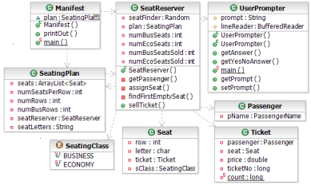
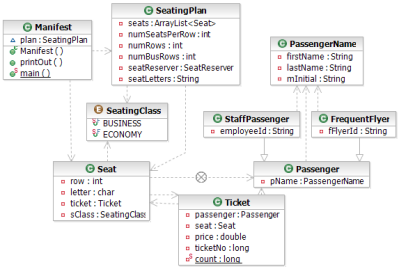

# COMP311 Assignment 2: Debugging exercise

## Instructions

You are given a JAR that contains source code.

1\. Import the Java source into Eclipse. Follow instructions from the
instructor if you are not familiar with Eclipse

2\. Run the program a few times to see how it works. You should see
clear evidence of bugs.

3\. Use the debugger to trace what is going
wrong. Resist the temptation to just read the code looking for bugs.
The instructor will walk you through using the debugger to determine
what code causes at least one of the problems.

4\. Continue to debug and fix bugs as you go until you are satisfied
you have done all that you can with this code.

5\. Answer the questions on the questions page.

6\. Hand in your answers when you are done.

The JAR file contains 12 types, as shown in the following partial UML
class diagrams.

UML class diagram 1 of air ticketing example:

UML class diagram 2 of air ticketing
example:

Not shown in these diagrams is the interface **Discountable**,
implemented by the class **StaffPassenger**.
